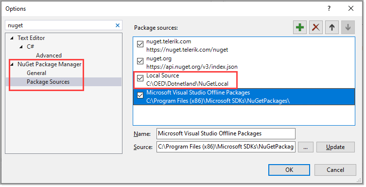

# For using this solution

Under the folder `LocalNuGetPackage` in this solution, place into another Visual Studio solution, build followed by taking the file `ConfigurationLibrary.1.0.1.nupkg` and placing it under C:\OED\Dotnetland\NuGetLocal. This is required for the project `Oed.EntityFrameworkCoreHelpers`.

**Note** `C:\OED\Dotnetland\NuGetLocal` is just a suggestion.

Make sure to setup a feed under options in Visual Studio as per below.

