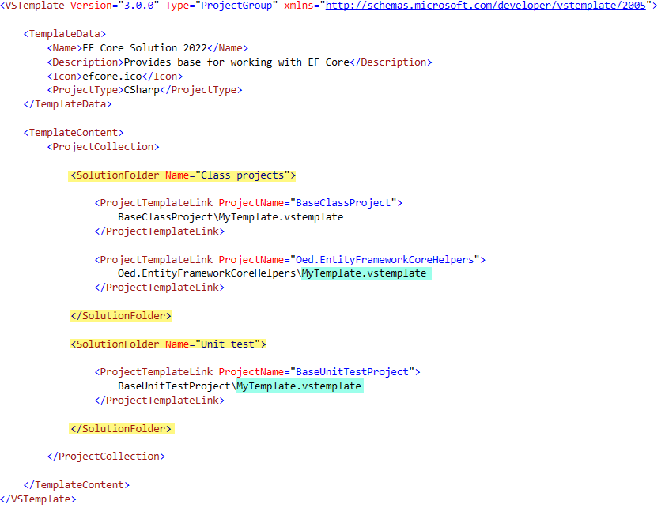
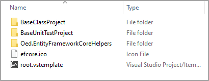
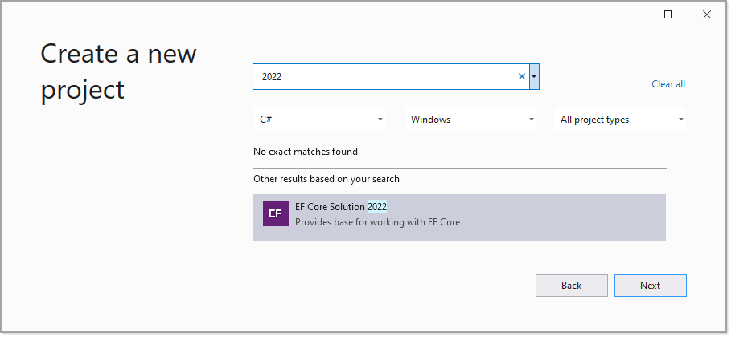

# How to: Create Visual Studio templates

Creating applications in an organization or for developers working outside of a team, using a standard Visual Studio solution template makes sense. Why create a new project in Visual Studio time and time again from a base solution and add projects. At some point something changes in say one out of ten projects now this can cause problems.

#  There are several options

:green_circle: Option 1

Create projects that fulfill specific needs, export the project as a [project template](https://docs.microsoft.com/en-us/visualstudio/ide/how-to-create-project-templates?view=vs-2019). When working in a team, share templates.

:green_circle: Option 2

Same as option 1 while for common functionality in a template consider using [local NuGet packages](https://docs.microsoft.com/en-us/nuget/hosting-packages/local-feeds) when code should not be public. In an addition add in pubic NuGet packages.

:green_circle: Option 3

Determine what an ideal Visual Studio solution should have and create a Visual Studio [solution template](https://docs.microsoft.com/en-us/visualstudio/ide/how-to-create-multi-project-templates?view=vs-2019). Within this template follow the same logic as option 2 while this time the outcome is a Visual Studio template rather than a project template.

Using of these options start with creating solution explorer folders which are no real folders, they assist in compartmentalizing like code e.g. class project under a folder named `Class projects` while unit test projects are under a folder named `Unit test projects`.

High level, using `solution folders` helps organize different project types. By collapsing solution folders on a large project can make it easier to focus on a task rather than have to scroll through the entire solution Explorer. Solution folders can have solution folders within, for instance, a solution folder is named Unit Test projects and have two other folders, one for frontend and backend test. 

There can be multiple Visual Studio solution templates, one for web, one for mobile, another for desktop while each has commonality.

For instance a base unit test which has an appsettings.json file suitable for testing Entity Framework Core or working with data using a data provider.

Another project for data operations with standard local NuGet packages for connecting to data regardless of the data provider.

# Steps to create a solution template

Figure out what needs to be in the solution template and local NuGet packages where packages in  a team environment are accessible to all team members. Even without a team consider creating a folder the local machine for allowing testing without other developers attempting to use unfinished work or possibly unstable code.

Next, create empty solution and a source code repository for the solution.

Add each project under appropriate solution folders.

Perform unit test and code reviews.

Now its time to create a project template for each project in the solution as outlined [here](https://docs.microsoft.com/en-us/visualstudio/ide/how-to-create-project-templates?view=vs-2019).

When performing the export, un-check the option to copy each exported project to the default template folder, only allow exporting to `My Templates'.

Create a folder under the current solution named `Templates`.

Unzip each of the exported project templates under the `Templates` folder.

Select a .ico (icon file for the solution template) and place at the root of the `Templates` folder.

In the root folder of the `Templates' folder create a new text file named `root.vstemplate`.

Add each project to the file. Using this current solution as an example we will have.

```xml
<VSTemplate Version="3.0.0" Type="ProjectGroup" xmlns="http://schemas.microsoft.com/developer/vstemplate/2005">

	<TemplateData>
		<Name>EF Core Solution 2022</Name>
		<Description>Provides base for working with EF Core</Description>
		<Icon>efcore.ico</Icon>
		<ProjectType>CSharp</ProjectType>
	</TemplateData>

	<TemplateContent>
		<ProjectCollection>

			<SolutionFolder Name="Class projects">

				<ProjectTemplateLink ProjectName="BaseClassProject">
					BaseClassProject\MyTemplate.vstemplate
				</ProjectTemplateLink>

				<ProjectTemplateLink ProjectName="Oed.EntityFrameworkCoreHelpers">
					Oed.EntityFrameworkCoreHelpers\MyTemplate.vstemplate
				</ProjectTemplateLink>
                
			</SolutionFolder>

			<SolutionFolder Name="Unit test">
				<ProjectTemplateLink ProjectName="BaseUnitTestProject">
					BaseUnitTestProject\MyTemplate.vstemplate
				</ProjectTemplateLink>
			</SolutionFolder>

		</ProjectCollection>

	</TemplateContent>
</VSTemplate>
```

Notes on the file above

- Yellow highlights are to place projects in specific solution folders.
- `MyTemplate.vstemplate` was created during each project export process.
- The `xmlns attribute` assist in troubleshooting as per the following [Troubleshoot templates](https://docs.microsoft.com/en-us/visualstudio/ide/how-to-troubleshoot-templates?view=vs-2019).





:green_circle: Create a .zip file of the `Templates` folder which for this solution looks like this.

Place the zip file under the following folder and change **2019** to the version of your Visual Studio.

C:\Users\\**YourUserName**\\Documents\Visual Studio **2019**\Templates\ProjectTemplates




:green_circle: Last step

Create a new project, in the search input type in either the first part of the template name just created or part of the name entered under `<TemplateData>` description, in the image below `2022` is part of the description which works in this case.



# :red_circle: Important

Make sure to read [this](Requires.md) if using this solution as a template.

# Closing

What has been presented is a simple Visual Studio template where much more is possible dependent on what is best for a developer or a team of developers.

